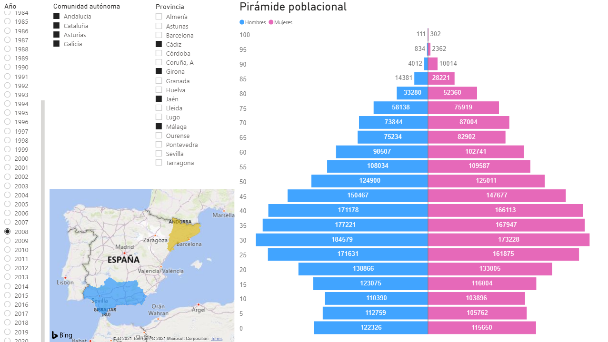

# Pirámide poblacional
Aplicación de Power BI para visualizar la pirámide poblacional de España según el año.

Se proporcionan filtros para escoger la provincia (o provincias) que estudiar, y un listado de años (entre 1971 y 2020).

Los datos se descargan directamente de [la web del INE](https://www.ine.es/jaxiT3/files/t/es/csv_bdsc/31304.csv?nocab=1) y se procesan en la aplicación. `data.csv` contiene una copia de ellos, por si se quisiera utilizar localmente. En tal caso hay que configurar `data.csv` como fuente de datos.

## Problemas
- La pirámide no se reescala al escoger una provincia (creo que para ello habría que crear un filtro como lista, en lugar de un mapa, pero queda más feo).
- Power BI detecta algunas provincias como americanas.
- ¿Por qué una lista de años y no un deslizador? Porque Power BI no deja hacer deslizadores con un solo valor. :)
- Los intervalos de años no indican un intervalo (indican `30`, en vez de `30-34`). Esto es por vagancia, más que otra cosa. Entiéndase que todos son intervalos de 5 años, menos `100`, que es `100 y más`.